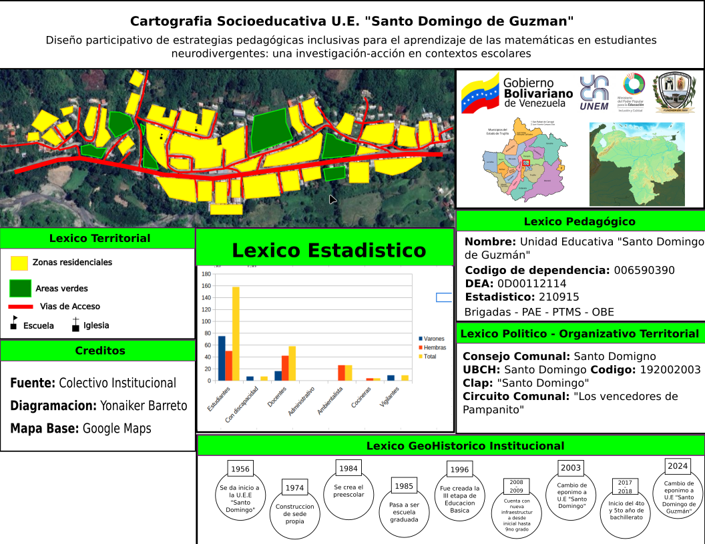
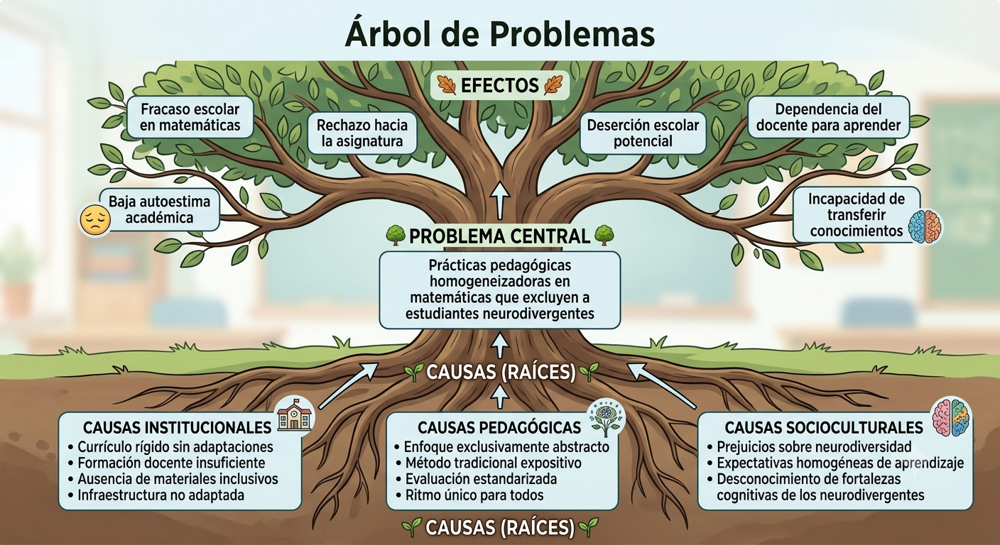

**PROYECTO**: Estrategias lúdicas e inclusivas para la resolución de operaciones combinadas en fracciones como una praxis transformadora con estudiantes neurodivergentes de primer año de la U.E. Santo Domingo de Guzmán del estado Trujillo

# Momento I: Reflexión Inicial sobre el Contexto
El Momento I: Reflexión Inicial sobre el Contexto constituye la fase fundacional del proceso investigativo y es esencial para enraizar el proyecto en la realidad concreta de la Unidad Educativa Santo Domingo de Guzmán, ubicada en la parroquia Santo Domingo. Su relevancia radica en facilitar una inmersión activa mediante el Diagnóstico Situacional Participativo (DSP), que va más allá de los datos cuantitativos para comprender las complejas interrelaciones entre las problemáticas educativas presentes.

Este momento asegura que la investigación no sea abstracta, sino que responda al sentir del colectivo educativo. Por ello, abordar esta problemática resulta fundamental para elevar la calidad educativa mediante un proyecto especializado.

## DIAGNÓSTICO SITUACIONAL PARTICIPATIVO
### Breve Introducción de la Institución

La **Unidad Educativa "Santo Domingo de Guzmán"** es una institución pública venezolana ubicada en el Municipio Pampanito, Estado Trujillo, fundada en **1958** y con una trayectoria de más de 65 años de servicio educativo. La institución funciona en dos turnos (mañana y tarde), atendiendo niveles de educación inicial, primaria y media general, con una matrícula aproximada de **160 estudiantes** y un cuerpo docente de aproximadamente **60 profesionales**.

En el año escolar 2017-2018, la institución amplió su oferta académica al incorporar el 4to y 5to año de bachillerato.
### Plan de Acercamiento

| **Actividad**                                     | **Estrategia**                       | **Técnica/Instrumento**                                     | **Responsable**  | **Lugar y Fecha**                   | **Observación** |
| :------------------------------------------------ | :----------------------------------- | :---------------------------------------------------------- | :--------------- | :---------------------------------- | :-------------- |
| Contacto inicial con directivos y docentes        | Reunión de presentación del proyecto | Carta de intención                                          | Yonaiker Barreto | Sala de dirección;                  |                 |

### Propósito del Plan

El plan de acercamiento tiene como propósito fundamental **establecer una inmersión activa y ética en la realidad de la U.E. "Santo Domingo de Guzmán"**, garantizando que el proceso investigativo no sea abstracto, sino que responda al sentir y necesidades del colectivo educativo.

### Diagnóstico Pedagógico Institucional Socioeconómico

La Unidad Educativa "Santo Domingo de Guzmán", ubicada en el Municipio Pampanito, Estado Trujillo, Venezuela, se encuentra situada en una zona residencial densa que la rodea, con infraestructura vial que facilita la conectividad con la comunidad; destaca por su cercanía estratégica con la iglesia, formando un núcleo socio-cultural, y cuenta con áreas verdes que permiten actividades al aire libre. La institución, fundada en 1958 y actualizada en 2024 bajo el nombre de "Santo Domingo de Guzmán", atiende aproximadamente 160 estudiantes con predominio masculino, incluyendo un segmento de estudiantes neurodivergentes, lo que plantea desafíos en cuanto a la escasa formación docente en neurodiversidad y la desinformación de las familias al respecto. Cuenta con un cuerpo docente de 60 profesionales, aunque se percibe la falta de un docente CRA y de personal en el turno de la tarde para algunas áreas de formación críticas, complementado por personal operativo administrativo, ambientalista, cocineras de la patria y vigilantes. Su identificación oficial corresponde al código de dependencia 006590390 y DEA 0D00112114, y mantiene programas activos como PAE, PTMS, Brigadas y OBE, a pesar de la ausencia de materiales didácticos multisensoriales que limitan la inclusión plena, vinculándose al Consejo Comunal "Santo Domingo" y al Circuito Comunal "Los Vencedores de Pampanito". Históricamente, ha evolucionado desde su fundación en 1958, construyendo su sede propia en 1974, expandiéndose al nivel preescolar en 1984-1985, incorporando la III Etapa de Educación Básica en 1996, modernizando su infraestructura en 2008-2009, si bien aún enfrenta desafíos como filtraciones de agua en paredes y techo, aulas con paredes rayadas y dañadas, y la falta de herramientas tecnológicas propias (computadoras, impresora, etc.), y ampliando su oferta con bachillerato en 2017-2018. Geográficamente, se localiza a 354 metros de altitud sobre los márgenes del río Mocoy, con un clima cálido entre 27°C y 37°C, comunicada mediante carretera con Trujillo y Valera, en un contexto de vulnerabilidad socioeconómica típico de zonas rurales venezolanas, donde los problemas de falta de agua son recurrentes, y cuenta con un ambulatorio cercano que facilita diagnósticos médicos.
### Cartografía Socioeducativa

### Técnicas e Instrumentos Utilizados

## DIRECCIONALIDAD DEL PROCESO INVESTIGATIVO — JERARQUIZACIÓN

### Problemas Identificados en el Diagnóstico

Durante el diagnóstico situacional participativo se identificaron **múltiples problemáticas**:

1. Escasa formación docente en neurodiversidad
2. Ausencia de materiales didácticos multisensoriales
3. Familias desinformadas sobre neurodiversidad
4. Problemas de falta de agua
5. filtraciones de agua en paredes y techo
6. aulas con paredes rayadas y dañadas.
7. falta de herramientas tecnologicas propias (computadoras, impresora, etc).
8. falta de personal en el turno de la tarde para algunas areas de formacion criticas.
9. falta de docente CRA.
10. Prácticas pedagógicas homogeneizadoras en matemáticas
### Matriz de Priorización del Problema

| Problema                                                              | Impacto | Urgencia   |
| :-------------------------------------------------------------------- | :------ | :--------- |
| 1. Escasa formación docente en neurodiversidad                        | Alto    | Importante |
| 2. Ausencia de materiales didácticos multisensoriales                 | Alto    | Importante |
| 3. Familias desinformadas sobre neurodiversidad                       | Medio   | Importante |
| 4. Problemas de falta de agua                                         | Alto    | Urgente    |
| 5. Filtraciones de agua en paredes y techo                            | Alto    | Urgente    |
| 6. Aulas con paredes rayadas y dañadas.                               | Bajo    | No Urgente |
| 7. Falta de herramientas tecnológicas propias (computadoras, impresora, etc). | Medio   | Importante |
| 8. Falta de personal en el turno de la tarde para algunas áreas de formación críticas. | Alto    | Urgente    |
| 9. Falta de docente CRA.                                              | Medio   | Importante |
| 10. Prácticas pedagógicas homogeneizadoras en matemáticas             | Alto    | Urgente    |
### Resultado: Problema Priorizado

**Prácticas pedagógicas homogeneizadoras en matemáticas que excluyen a estudiantes neurodivergentes**. Afecta a todos los estudiantes neurodivergentes, tiene grave impacto en su desempeño académico y autoconcepto, es abordable mediante el diseño participativo de estrategias inclusivas, y su resolución genera el beneficio más amplio para la población objetivo.

### Árbol del Problema

### Interrogantes de la Investigación

- **¿Por qué?** Porque las prácticas pedagógicas homogeneizadoras predominan
- **¿Para qué?** Para diseñar estrategias pedagógicas inclusivas participativas para el aprendizaje matemático de estudiantes neurodivergentes
- **¿Para quién?** Para los estudiantes
- **¿Con quién?** Docentes, especialistas, familias, estudiantes
- **¿Cómo?** Con estrategias pedagógicas inclusivas en el mejoramiento del aprendizaje matemático de los estudiantes neurodivergentes
- **¿Cuándo?** Lo mas pronto posible
- **¿Dónde?** En la U.E. "Santo Domingo de Guzmán"
### Propósito General

Implementar estrategias lúdicas e inclusivas para la resolución de operaciones combinadas en fracciones como una praxis transformadora con estudiantes neurodivergentes de primer año de la U.E. Santo Domingo de Guzmán del municipio Pampanito del estado Trujillo

### Propósitos Específicos

1.  **Diagnosticar** las necesidades y estilos de aprendizaje de los estudiantes neurodivergentes de primer año de la U.E. Santo Domingo de Guzmán en la resolución de operaciones combinadas con fracciones.
2.  **Diseñar** estrategias lúdicas e inclusivas, adaptadas a las características de los estudiantes neurodivergentes, para la enseñanza de operaciones combinadas en fracciones.
3.  **Aplicar** las estrategias lúdicas e inclusivas diseñadas con los estudiantes neurodivergentes de primer año para la resolución de operaciones combinadas en fracciones.
4.  **Evaluar** el impacto de las estrategias lúdicas e inclusivas implementadas en el desempeño y la motivación de los estudiantes neurodivergentes en la resolución de operaciones combinadas en fracciones.
### Línea de Investigación

> **Enseñanza-Aprendizaje de la Matemática**
> 
> Esta investigación se enmarca en la línea de investigación sobre los procesos de enseñanza y aprendizaje de las matemáticas, específicamente en el subcampo de la **didáctica inclusiva y atención a la diversidad en contextos escolares**.

### Alternativas de Solución

1. Diseño de secuencias didácticas multisensoriales para la enseñanza de operaciones básicas  
2. Creación de material manipulativo adaptado para comprensión de conceptos geométricos  
3. Implementación de rutinas visuales y estructuradas para estudiantes con TEA  
4. Desarrollo de juegos matemáticos con movimiento para estudiantes con TDAH  
5. Construcción de representaciones concretas para estudiantes con Discalculia  
6. Formación docente en estrategias de diferenciación pedagógica  7. Establecimiento de alianzas con familias para continuidad del apoyo matemático